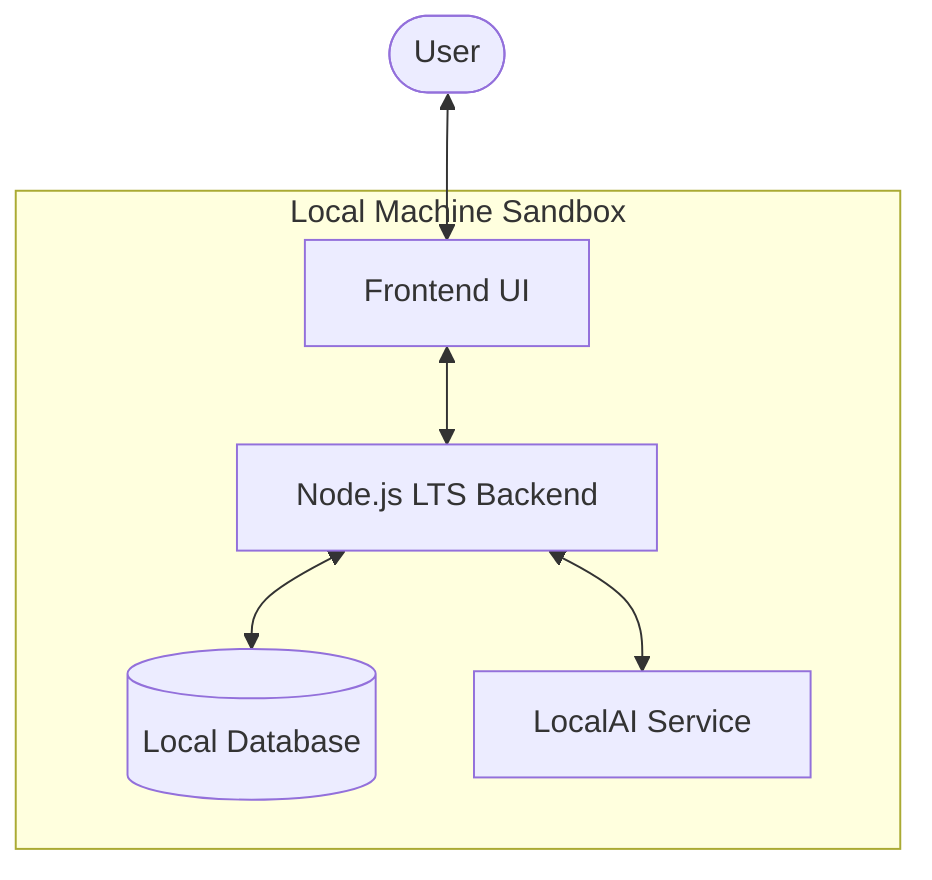

# KAIwa 🇯🇵

A fully local, privacy-first Japanese learning tutor — like Pingo, but powered by LocalAI running entirely on your machine.

## Overview & Capstone Context

KAIwa is designed to solve two main friction points in modern AI-assisted language learning:
1. **Data Privacy**: Language practice is highly personal. KAIwa ensures all conversations, skill levels, and progress data remain 100% local.
2. **Cost & Accessibility**: By leveraging offline local LLMs via LocalAI, users avoid recurring API subscription fees and can practice without an active internet connection.

This project is built as a capstone project focusing on offline-first AI application architecture.

## Core Features
- **JLPT Reviewer** — Practice questions and progress tracking, starting at the N5 level.
- **AI Kaiwa (会話)** — Real-time conversational practice with a local LLM, utilizing LocalAI.
- **Persistent Memory** — Locally persisted user profiles, skill levels, and JLPT scores across sessions.
- **100% Local & Private** — No external API calls or telemetry; your data never leaves your machine.

## System Architecture

## Tech Stack
- **Runtime & Backend**: Node.js LTS
- **Frontend**: TBD
- **AI Inference**: LocalAI (Self-hosted, running local-only LLM/VLM models)
- **Storage**: TBD (Local database/file-based storage for persistent memory)

## Status
🚧 Early development — capstone project in progress.

## Setup
Instructions coming soon.

## License
See [LICENSE](./LICENSE)