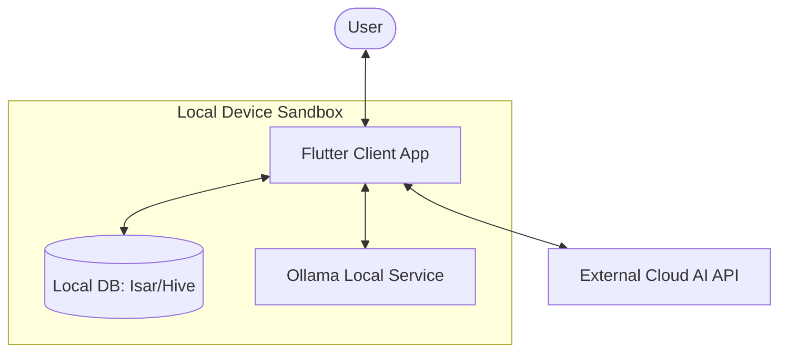

# KAIwa 🇯🇵

A fully local, privacy-first Japanese learning tutor — like Pingo, but powered by Ollama running entirely on your machine.

## Overview & Capstone Context

KAIwa is designed to solve two main friction points in modern AI-assisted language learning:
1. **Data Privacy**: Language practice is highly personal. KAIwa ensures all conversations, skill levels, and progress data remain 100% local.
2. **Cost & Accessibility**: By leveraging offline local LLMs via Ollama, users avoid recurring API subscription fees and can practice without an active internet connection.

Additionally, KAIwa offers the flexibility to configure custom/external AI API keys for users who prefer using cloud models (like OpenAI, Gemini, or Claude).

This project is built as a capstone project focusing on cross-platform application design and offline-first AI architecture.

## Core Features
- **JLPT Reviewer** — Practice questions and progress tracking, starting at the N5 level.
- **AI Kaiwa (会話)** — Real-time conversational practice powered by Ollama (local) or external API keys (cloud).
- **Persistent Memory** — Locally persisted user profiles, skill levels, and JLPT scores across sessions.
- **Privacy-First** — User data is stored locally and never sent to remote servers.

## System Architecture

## Tech Stack
- **Frontend / Client**: Flutter (Dart) — Cross-platform (iOS, Android, Desktop)
- **AI Inference**: Ollama (default local inference) or custom external APIs (OpenAI, Gemini, etc.)
- **Storage**: Local persistent storage (such as Isar, Hive, or Drift)

## Status
🚧 Early development — capstone project in progress.

## Setup
Instructions coming soon.

## License
See [LICENSE](./LICENSE)